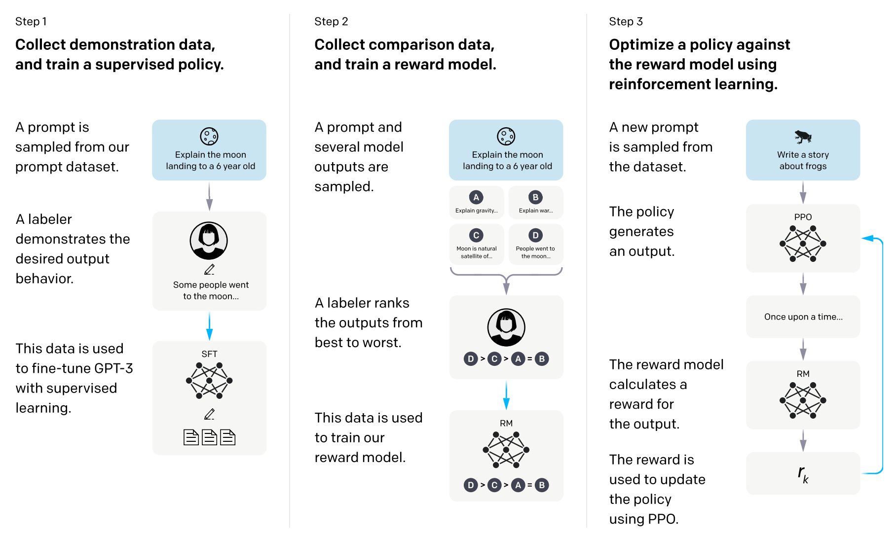

# Optimizing-GPT-2-with-Reinforcement-Learning-from-Human-Feedback

ChatGPT has three stages, which is based on InstructGPT which was the last open publication on this topic from OpenAI. The first state is Supervised Finetuning stage or Instruct Tuning stage where model is traning on different taks(InstructGPT was trained on 30K task) in supervised autoregressive way. 
In second stage we perform reward model traning and in last stage we perform RL with human feeback with Proximal Policy Gradient. Here's a diagram from the InstructGPT paper:

### To Do
- [] Add deep speed optimizations
- [] serve chat based application

# Directory
```bash
src
  |_config
    configs.py # Training and model Configs
  |_experiments
    |_main.py # some scratch code to quickly test something
  |_inference
  |_models
    |_gpt.py # GPT-2 implementation with LoRA
    |_llama.py # wish I could have more time to test with LLaMA
  |_training
    |_train_ppo.py # training script for PPO 
    |_train_rm.py # trianing script for Reward Model
    |_train_sft.py # training script for SFT model
    |_tariners.py # the actual training loops and other trainer utilities, such as saving states
  |_utils
    |_dataset.py # multiple datasets definition
    |_evaluate.py # evaluate the generation with ChatGPT
    |_loss.py # loss functions used in different training
    |_prepare_sft_dataset.py
    |_tokenizer.py # tokenizers in a unified class
requirements.txt # dependencies without PyTorch! Install your own pytorch 2.0 nightly.
```

# Get Started
ChatGPT (or InstructGPT, which is the last open publication on this topic from OpenAI) has three stages: Supervised Fine-tuning, Reward Model Training and RL with Human Feedback (with Proximal Policy Gradient). Here's a diagram from the InstructGPT paper:



0. You need to have a GPU with at least 16GB VRAM, CUDA 11.7+ and also Python 3.8 or higher (other versions of CUDA and Python might work but I didn't test, Python 2.0 is very demanding.).
1. Install [PyTorch 2.0](https://pytorch.org/get-started/pytorch-2.0/#getting-started)
2. Install dependencies with
```bash
pip install -r requirements.txt
```
3. The first step is to traing a SFT model, inside `src` directory, run this command. You can change batch size via `-b`. The bigger VRAM you have the larger batch size you can afford. Optionally, you can open the tensorboard.ipynb to check the training progress.
```bash
python training/train_sft.py --n experiment_name -b 2`
```
4. Once you finished SFT stage, you can start to train the reward model. You should have a directory started with `sft_` in your `runs` directory. Find the final model weights and run this. This should start a reward model training for 1 epoch and generate a directory started with `rm_` with weights in it.
```bash
python training/train_rm.py -b 2 -n experiment_name -p "./runs/path/to/your/weights"
```
5. Finally, you can start the RLHF with the reward model and SFT model you get from previous two steps. Run this command. Because the training is not stable sometimes, I stopped early around 12K steps with a batch size of 1. The final weights will be in a directory started with `ppo_`.
```bash
python training/train_rm.py -b 2 -n experiment_name -a "./runs/path/to/sft/weights" -c "./runs/path/to/reward_model/weights" -s naive
```

## Evaluate
0. You need to have an OpenAI account with credential key
1. Put your key into a file called "openai.key" JSON file. It should be a dictionary with a key called "OPENAI_API_KEY" and the value is your key.
2. Inside `src`, run this:
```bash
python utils/evaluate.py -s "/path/to/sft/model" -p "/path/to/ppo/model"
```
3. This should generate the "Human" preference over each model using ChatGPT as a proxy


# Reproducing GPT2 Model
Based on [NanoGPT](https://github.com/karpathy/nanoGPT/blob/master/model.py)

Strucutre
```python
GPT
    __init__
        TransformerDecoder
        lm_head
    forward(x)
        return lm_head(TransformerDecoder(x))
    from_checkpoint
    from_pretrained
    generate
    batch_generate
```
```python
TransformerDecoder
    __init__()
        # Layers
            # token_embedding_layer
            # postion_embedding_layer
            # input_dropout
            # decoder_blocks = [TransformerDecoderBlock(cfg) for _ in range(cfg.n_layers)]
            # ln = LayerNorm
        
    forward(x, attention_mask):
        # pos, token_embeddings, pos_embeddings
        x = input_dropout(token_embeddings + pos_embeddings)

        # Stack N blocks
        for block in self.decoder_blocks:
            x = block(x)

        y = ln(x)

    TransformerDecoderBlock
        __init__()
            # Layers
                # ln1, ln2 = LayerNorm
                # mmsa = MaskedMultiheadSelfAttention
                # ffn = FeedForwardNetworks
        forward(x, attention_mask):
            # identity1 = x     # For Residual connection
            # x = identity1 + mmsa(ln1(x))
            # identity2 = x
            # x = identity2 + mmsa(ln1(x))
            # return x

    MaskedMultiheadSelfAttention
        __init__
            Q, K, V, attention_dropout, output_dropout, mask
        forward(x, attention_mask):
            # x3 <- qkv_projection(x)
            # Q, K, V = x3.split()
            # attention = Q @ K.transpose(2, 3)
            # apply attention_mask to attention
            # attention_dropout
            # weighted_value = attention @ V
            # project weighted_value linearly to get output
            # y = output_projection(weighted_value)


```

# Acknowledgement
1. [nanoGPT](https://github.com/karpathy/nanoGPT)
2. [OpenAI Baselines](https://github.com/openai/baselines)
3. [OpenAssistant](https://github.com/LAION-AI/Open-Assistant)
4. [Anthropic HH RLHF](https://github.com/anthropics/hh-rlhf)
5. [minChatGPT](https://github.com/ethanyanjiali/minChatGPT)
6. [transformer_library](https://github.com/huggingface/transformers/blob/main/src/transformers/models/gpt2/modeling_gpt2.py)

